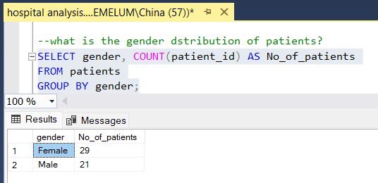
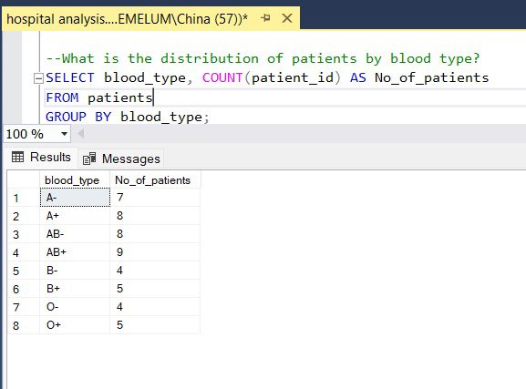
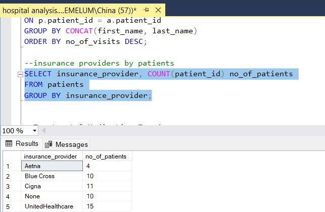
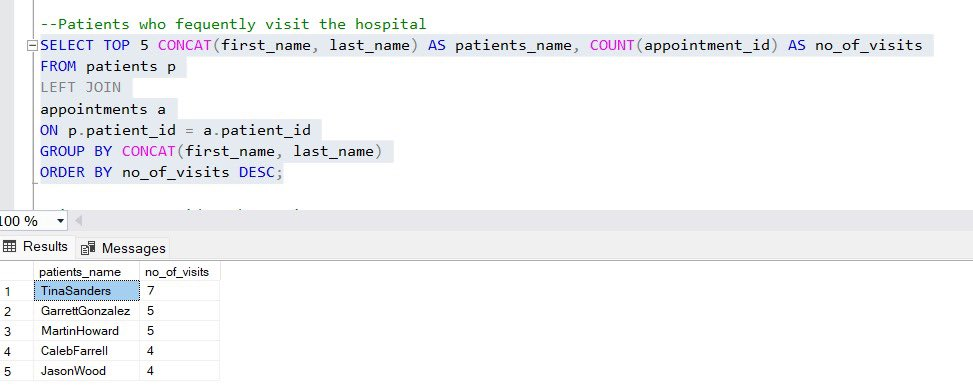
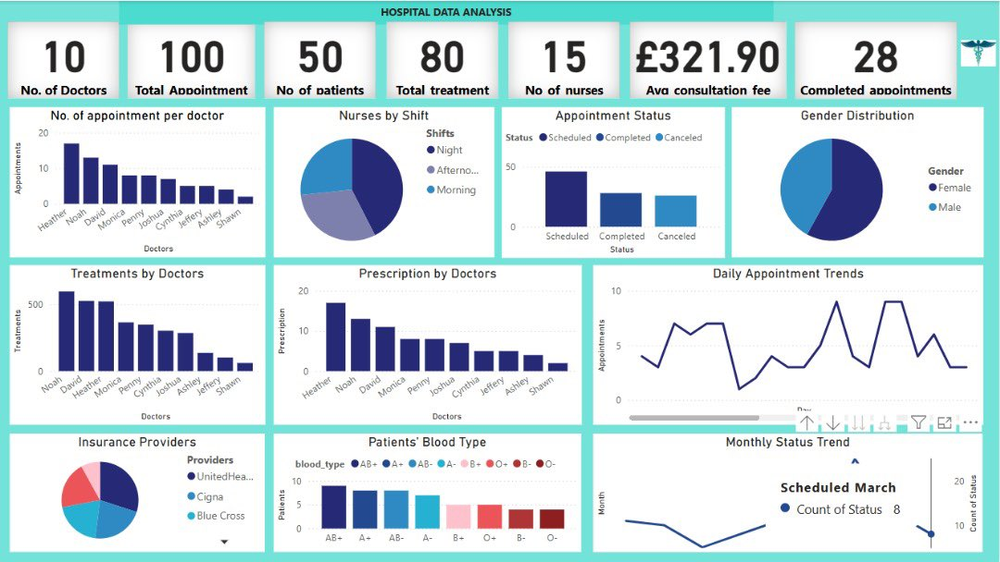

# Hospital-Performance-Analysis

This Project analyzes the management and performance of a hospital, shedding light on peak appointment hours, the most common reasons for patient visits, and performance metrics for doctors.

# Understanding the dataset
The dataset contained multiple tables.
- Doctors
- Patients
- Nurses
- Appointments and
- Treatments

# Objective Questions
1. What is the gender distribution of the patients?
2. What is the distribution of patients by blood type?
3. How many appointments were scheduled per doctor in February?
4. Which doctor handled the most appointments?
5. Which doctor prescribed the most medication?
6. Which doctor has the highest consultation fee?
7. Which specialization attracts the highest number of patients?
8. How many patients are subscribed to each insurance provider?
9. How many treatments were provided by the doctors in the last three months?
10. Which patients frequently visit the hospital? 

# Tools
Tools & Skills Used:
- ✅ Power BI
- ✅ Microsoft SQL Server: Subqueries, Joins, etc.
- ✅ Data storytelling & visual reporting

# Exploratory Data Analysis
### 1.  What is the gender distribution of the patients?

The results show that there are more female than male patients in the hospital. The female patients account for 58% while 42% of the patients are male.

### 2.  What is the distribution of patients by blood type?

Most patients have the AB+ blood type, while the O- and B- are the least available in the hospital. This may mean that it will be easier to get a blood donor for the other blood types except for O- and B-.

### 3.  How many appointments were scheduled per doctor in February?

February had the 6 as the most appointments, which were handled by the doctor with doctor_Id 10 (who we found out to be Cynthia Adams), while the least appointment was 1 for doctor_Id 2

### 4. Which doctor handled the most appointments?

Although Dr.Cynthia had the most appointments in February, Dr. Heather has the highest total number of appointments (18 appointments), while the least is DR. Ashley and Dr. Shawn, each with a total of 5 appointments. 

### 5. Which doctor prescribed the most medication?

Dr. Heather White still has the highest number of prescriptions (17) while Dr. Shawn has the lowest number of appointments (2). It seems like Dr Heather is at the top of his profession. Are there factors contributing to his performance?

### 6. Which doctor has the highest consultation fee?

Dr. Jacobson, who is a neurologist, has the highest consultation fee of $475.41, followed closely by Dr. Smith, a pediatrician, and Dr. Gonzalez, a general surgeon, with $440.07 and $437.01, respectively.

### 7. Which specialization attracts the highest number of patients?

Most patients visiting the hospital seem to have issues with the heart because the Cardiologists attract the highest number of appointments, followed closely by Neurologists and Psychiatrists.

### 8. How many patients are subscribed to each insurance provider?

About 20% of the patients have no insurance coverage at all. UnitedHealthcare has the largest number of patients (15), followed by Cigna, Bluecross and Aetna. 
What should be done about the patients without insurance coverage?

### 9. How many treatments were provided by the doctors in the last three months?

It is justified that Dr. Heather White has treated the largest number of patients in the last 3 months because he has the highest number of patients and prescriptions, followed by Dr. Joshua Smith, while Dr. Shawn is still in the last position. 
Why does Dr. Shawn not have a lot of patients?

### 10. Which patients frequently visit the hospital? 

Tina Sanders! She has visited the hospital 7 times! What could be the issue? We need to investigate further to find out who is treating her and why she keeps visiting.

# Dashboard

# Key Findings
- ➡️ Dr. Heather White leads in appointments, treatments, & prescriptions.
- ➡️ Cardiology is the most in-demand specialization.
- ➡️ 20% of patients are uninsured.
- ➡️ Monthly appointments show a declining trend.

# Conclusion & Recommendations:
☑️ Replicate top performers’ strategies to improve efficiency
☑️ Increase insurance access through outreach or partnerships
